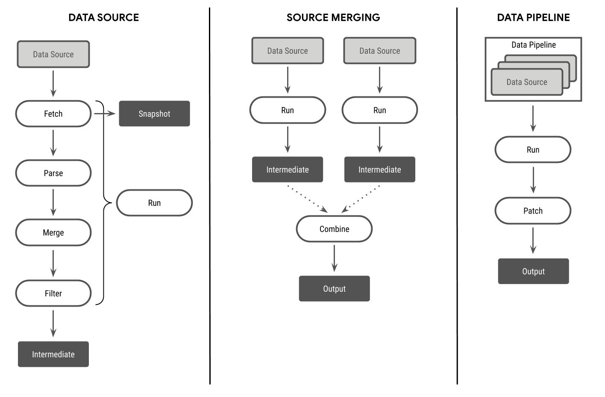

# src
This folder contains all the code necessary to update the data tables. It is a single Python package
with the following modules:
* [cache](./cache): used to help aggregating data sources which do not provide historical data
* [data](./data): auxiliary and help data files used during processing of input
* [lib](./lib): core functions and utilities used across the package
* [pipelines](./pipelines): contains all the individual pipelines that produce the data tables
* [scripts](./scripts): collection of miscellaneous scripts, used only for manual processing
* [test](./test): unit testing of core functions

## Running
Data is automatically updated by the CI server on a schedule. To manually update the data for all
the pipeline chains, execute the `update.py` script:
```sh
python update.py
```

To update a specific pipeline chain, use the option `--only <comma_separated_names>`; for example:
```sh
python update.py --only index,demographics,geography
```

The update command will use the `output/tables` and `output/snapshot` folders at the root of the
project path. The raw data sources downloaded to produce outputs are placed under the `snapshot`
folder, and the processed data is placed in the `tables` folder.

Files in the `tables` folder are not meant to be used as-is. They are intended to be used for the
purpose of auditing changes in the dataset, being tracked by `git`. The files in the `tables` folder
are made available for general use after a [publishing step](#publish).

## Testing
To execute the unit tests, run the following command from this directory:
```sh
python -m unittest
```

## Contributing
To create a new table output, it is recommended to start by making a copy of the
[_template](pipelines/_template) folder. The name of the folder will determine the file name of the
output table, which will be placed under the output folder. For the pipeline chain to be
automatically run, add an import statement to the
[pipelines module init file](pipelines/__init__.py).

## Architecture
### Pipeline
Individual data sources are encoded as a `Pipeline`. Each pipeline goes through the following steps,
executed in order:
1. Fetch: download resources into raw data
1. Parse: convert raw data to structured format
1. Merge: associate each record with a known `key`
1. Filter: filter out unneeded data and keep only desired output columns

The majority of the processing in a pipeline will likely take place in the `parse` step. All
individual records output by the pipeline have to follow the following guidelines:
* Each record **must** be matched with a known `key` present in the auxiliary
  [metadata table](data/metadata.csv). Otherwise, it will be dropped from the output.
* Each record **may** include a `date` column, which must be ISO 8601 format (i.e. `YYYY-MM-DD`).

To make writing pipelines easier, a default implementation [`DefaultPipeline`](lib/pipeline.py)
already includes a lot of the functionality that is likely to be used by a standard data parsing
routine, including downloading and conversion of raw resources into a pandas `DataFrame`. See the
[template pipeline](pipelines/_template/srcname_pipeline.py) for a trivial example which subclasses
the `DefaultPipeline` implementation.

### Pipeline Chain
A `PipelineChain` object wraps a list of individual `Pipelines`. Each pipeline is executed in order
and the output is combined into a single data table. When values for the same `key` (or, if present,
`date`-`key` pair) overlap, the value present in the last pipeline in the list is chosen. For
example, if `pipeline1` outputs `{key: AA, value: 1}` and `pipeline2` outputs `{key: AA, value: 2}`,
then the combined output will be `{key: AA, value: 2}` -- assuming that `pipeline2` has a higher
index than `pipeline1` in the list. For this reason, you should order your pipelines from less
trustworthy to more trustworthy, so the less trustworthy values can be overwritten if more trusted
data is available.

`PipelineChain` objects define the schema of the output table. Individual `Pipeline` objects that
are part of the schema may output some or all columns defined in the schema, but columns not in the
schema will be filtered out in the final output.

### Overview
The following diagram summarizes the architecture:


## Publish
Data tables are made available for use via the `publish.py` script which uploads the files to a file
server and creates the different versions of the datasets (like date subsets, the master table, JSON
formatted files, etc.). Data is published automatically by the CI server with every change to the
master branch; to run the publish step locally, simply execute this script from the `src` directory:
```sh
python publish.py
```

## Caching
Some data sources are unreliable or only provide daily data (instead of historical). To improve the
resiliency of the data pipeline, you may also use a cache layer which creates hourly snapshots of
data sources, which can then be aggregated into historical data. See the [cache](./cache) folder for
more details.
